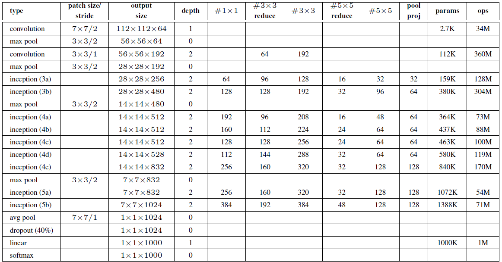

# GoogleNet
 
Google Net (or Inception V1) was proposed by research at Google (with the collaboration of various universities) in 2014 in the research paper titled “Going Deeper with Convolutions”. This architecture was the winner at the ILSVRC 2014 image classification challenge. It has provided a significant decrease in error rate as compared to previous winners AlexNet (Winner of ILSVRC 2012) and ZF-Net (Winner of ILSVRC 2013) and significantly less error rate than VGG (2014 runner up). This architecture uses techniques such as 1×1 convolutions in the middle of the architecture and global average pooling.

Model Architecture:

Below is Layer by Layer architectural details of GoogLeNet.

The architectural details of auxiliary classifiers as follows:

    An average pooling layer of filter size 5×5 and stride 3.
    A 1×1 convolution with 128 filters for dimension reduction and ReLU activation.
    A fully connected layer with 1025 outputs and ReLU activation
    Dropout Regularization with dropout ratio = 0.7
    A softmax classifier with 1000 classes output similar to the main softmax classifier.

